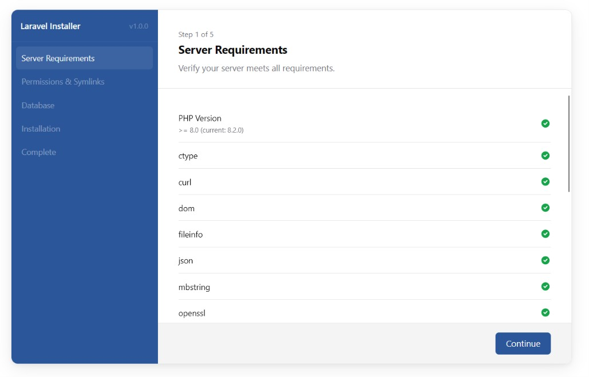

# Laravel Deployment GUI

A self-contained PHP web installer for Laravel applications. It gives your clients or end-users a clean, step-by-step browser interface to deploy a Laravel app without any CLI access, SSH, or technical knowledge.




## What It Solves

Distributing a Laravel application to a shared host or client server typically requires SSH access, Composer, Artisan commands, and manual `.env` configuration. This installer packages all of that into a single drag-and-drop directory that runs entirely in the browser. The user fills in their database credentials, validates a license if required, clicks Install, and the app is live.


## How It Works

The installer is placed alongside the app it deploys. At install time it:

1. Checks server requirements and PHP extensions
2. Verifies directory permissions and planned symlinks
3. Tests the database connection
4. Optionally validates a license key against your API
5. Copies project files to a timestamped deploy directory
6. Imports the database from a bundled SQL dump
7. Generates a configured `.env` file
8. Updates the public entry point to reference the new deploy path
9. Creates any configured symlinks


## Directory Layout

Place the installer inside the web root alongside the existing `index.php`:

```
/var/www/public_html/
├── index.php               ← existing entry point (updated after install)
├── installer/              ← this tool
│   ├── source-code/
│   │   ├── project/        ← full Laravel app (copied on install)
│   │   │   ├── public/     ← public assets (copied to parent directory)
│   │   │   └── .env.example
│   │   └── db.sql          ← database dump (imported on install)
│   ├── config/
│   ├── app/
│   ├── resources/
│   ├── vendor/
│   └── index.php           ← installer entry point
```

After installation the deployed app lands in a sibling directory:

```
/var/www/public_html/
├── index.php               ← updated to point to new app
├── installer/
└── app-name-1748000000/    ← deployed Laravel app
    ├── app/
    ├── storage/
    └── ...
```


## Requirements

**Server (where the installer runs)**
- PHP 8.0 or higher
- `curl` extension (for license validation)
- `pdo` + `pdo_mysql` extensions
- Write permission on the parent directory

**Source files (bundled inside `source-code/`)**
- `source-code/project/` - the full Laravel application
- `source-code/db.sql` - a full database dump (required if `requireDbFile` is `true`)
- `source-code/project/.env.example` - used as the template for `.env` generation


## Installation

1. Upload the `installer/` directory to your web server
2. Place your Laravel app files in `installer/source-code/project/`
3. Place your database dump at `installer/source-code/db.sql`
4. Configure `installer/config/` as described below
5. Visit `https://yourdomain.com/installer/` in a browser
6. Follow the wizard


## Configuration

All configuration lives in the `config/` directory across three files.


### `config/app.php`

General application and appearance settings.

```php
return [
    'name'           => 'My App Installer',
    'version'        => 'v1.0.0',
    'url'            => rtrim(dirname($_SERVER['SCRIPT_NAME']), '/'),
    'deployToParent' => true,
    'sidebarColor'   => '#6366f1',
    'accentColor'    => '#6366f1',
];
```

| Key | Type | Description |
|---|---|---|
| `name` | string | Installer title shown in the sidebar and browser tab |
| `version` | string | Version label shown in the sidebar |
| `url` | string | Base URL of the installer. The default auto-detects from the request path. Only change if auto-detection is wrong |
| `deployToParent` | bool | `true` deploys the app to the grandparent of the installer (typical shared hosting layout). `false` deploys as a sibling of the installer |
| `sidebarColor` | string | CSS colour for the sidebar background |
| `accentColor` | string | CSS colour for primary buttons and focus rings |


### `config/installation.php`

Controls the installation process.

```php
return [
    'requireDbFile' => true,
    'licenseUrl'    => '',
    'appId'         => '',
    'appSecret'     => '',
    'symlinks'      => [
        ['target' => 'storage/app/public', 'link' => 'storage'],
    ],
];
```

| Key | Type | Description |
|---|---|---|
| `requireDbFile` | bool | If `true`, checks that `source-code/db.sql` exists before allowing installation to proceed |
| `licenseUrl` | string | URL of your license validation API. When non-empty a **License** step is added before installation. Leave empty to skip license validation |
| `appId` | string | If set, written to the deployed `.env` as `APP_ID` |
| `appSecret` | string | If set, written to the deployed `.env` as `APP_SECRET` |
| `symlinks` | array | Symlinks to create after deployment. Each entry has a `target` (relative to the deployed app root) and a `link` name (created in the parent of the installer directory) |

**Symlink example**

The default creates the standard Laravel storage symlink:

```php
['target' => 'storage/app/public', 'link' => 'storage']
```

This produces:

```
/var/www/public_html/storage  →  /var/www/public_html/app-name-xxx/storage/app/public
```


### `config/requirements.php`

Defines the minimum PHP version and the extensions shown on the Server Requirements step.

```php
return [
    'php'        => '8.0',
    'symlinks'   => false,
    'extensions' => [
        ['name' => 'curl',     'required' => true],
        ['name' => 'mbstring', 'required' => true],
        // ...
        ['name' => 'gd',       'required' => false],
    ],
];
```

| Key | Type | Description |
|---|---|---|
| `php` | string | Minimum PHP version required |
| `symlinks` | bool | If `true`, adds a symlink-support check to the requirements list |
| `extensions` | array | Each entry has a `name` (PHP extension name) and `required` flag. `true` blocks proceeding on failure; `false` shows a warning only |


## License Validation

When `licenseUrl` is set the installer adds a License step to the wizard. The user enters a key and clicks Validate. The installer sends a `POST` request to your URL:

```json
{
    "license": "THE-KEY-ENTERED",
    "domain": "the-requesting-domain.com"
}
```

Your API should return JSON. Any of the following response shapes are treated as valid:

```json
{ "status": "success" }
{ "success": true }
{ "ok": true }
{ "valid": true }
```

A plain-text response of `true` is also accepted. Any other response, or an HTTP status outside `2xx`, is treated as invalid. On success the license key is written to the deployed `.env` as `APP_LC`.


## What Gets Written to `.env`

The installer generates `.env` from `source-code/project/.env.example`, replacing or appending the following keys:

| Key | Source |
|---|---|
| `APP_NAME` | Project name entered by the user |
| `APP_ENV` | Hard-coded to `production` |
| `APP_URL` | Application URL entered by the user |
| `APP_SUBFOLDER` | Parsed from the URL path (only written if the key already exists in `.env.example`) |
| `DB_HOST` | From the Database step |
| `DB_PORT` | From the Database step |
| `DB_DATABASE` | From the Database step |
| `DB_USERNAME` | From the Database step |
| `DB_PASSWORD` | From the Database step |
| `APP_LC` | License key (only if `licenseUrl` is configured and the key validated) |
| `APP_ID` | Value of `appId` in `config/installation.php` (only if non-empty) |
| `APP_SECRET` | Value of `appSecret` in `config/installation.php` (only if non-empty) |


## Wizard Steps

| Step | Description |
|---|---|
| **Server Requirements** | Checks PHP version and all configured extensions. Required failures block proceeding; optional failures show a warning |
| **Permissions & Symlinks** | Checks write permissions on required directories and shows a preview of symlinks that will be created |
| **Database** | Accepts connection details and tests them before allowing you to continue. If the database is non-empty the user must acknowledge that existing data will be overwritten (a backup is taken automatically) |
| **License** *(optional)* | Shown only when `licenseUrl` is set. The user enters their license key and validates it against your API before proceeding |
| **Installation** | Accepts project name and application URL. Clicking Install runs all deployment steps sequentially |
| **Complete** | Confirms success and provides a direct link to the installed application |


## Security Notes

- Delete or move the `installer/` directory after a successful installation. Leaving it accessible allows anyone to re-run the installer
- The `source-code/` directory contains your application source code. Ensure it is not publicly browsable if the installer remains on the server
- `APP_ID` and `APP_SECRET` in `config/installation.php` are embedded in the distributed installer package. Use read-only or installer-scoped credentials where possible
